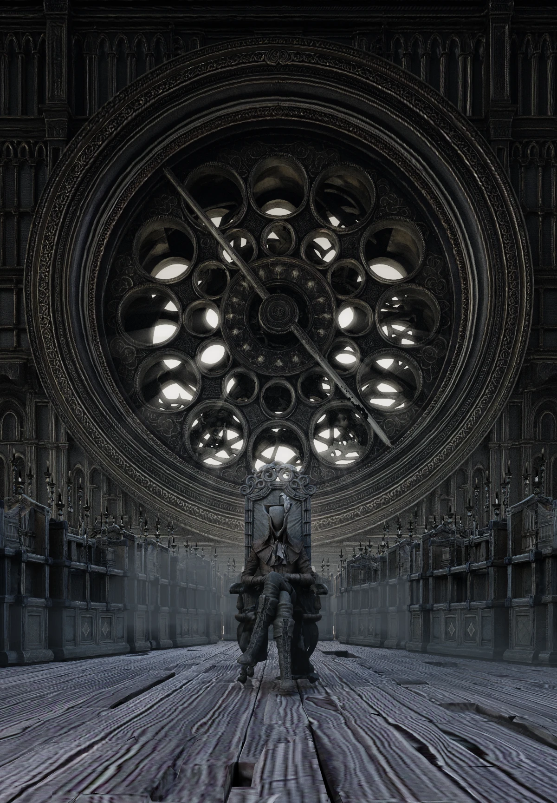
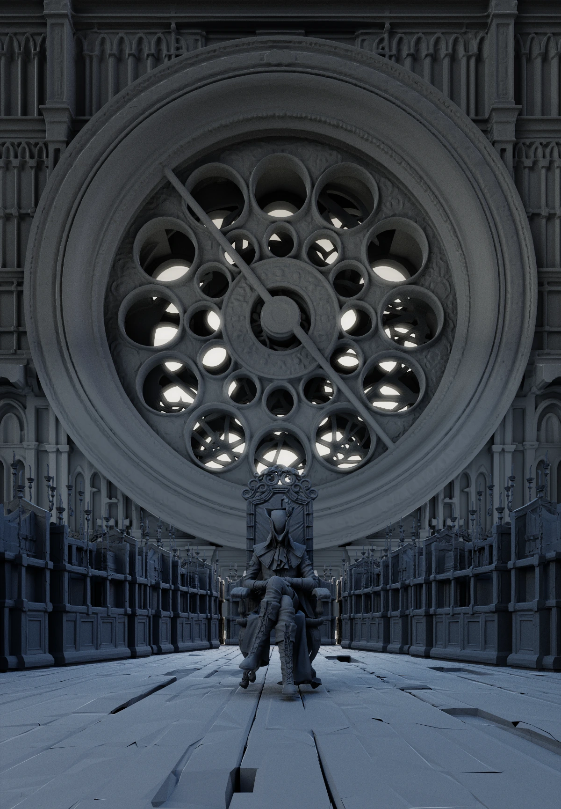
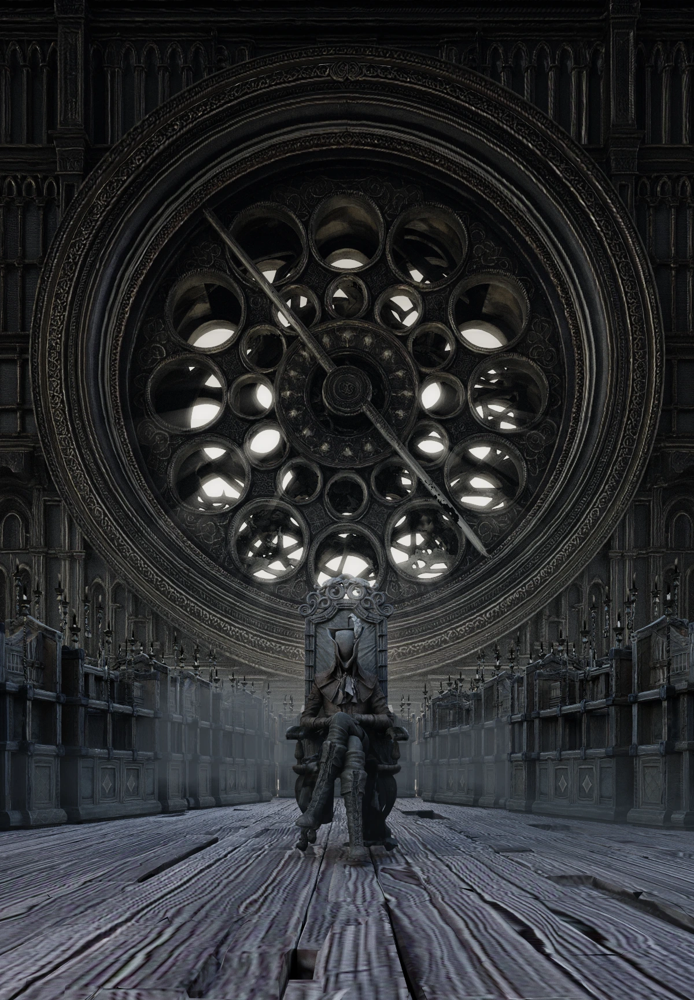
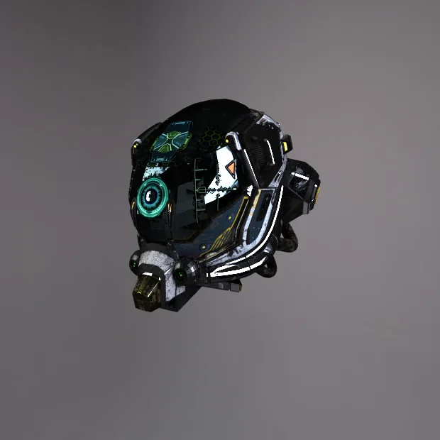
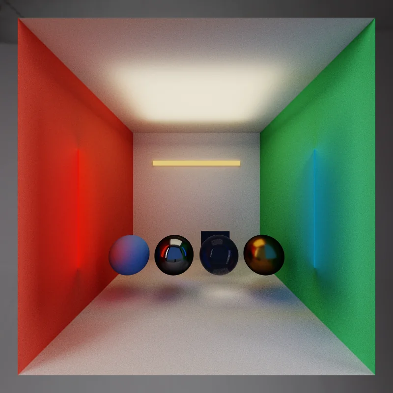
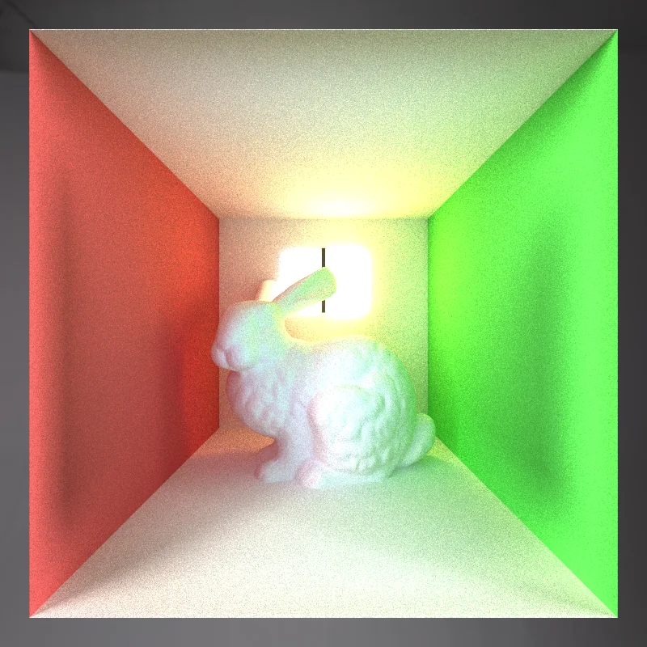
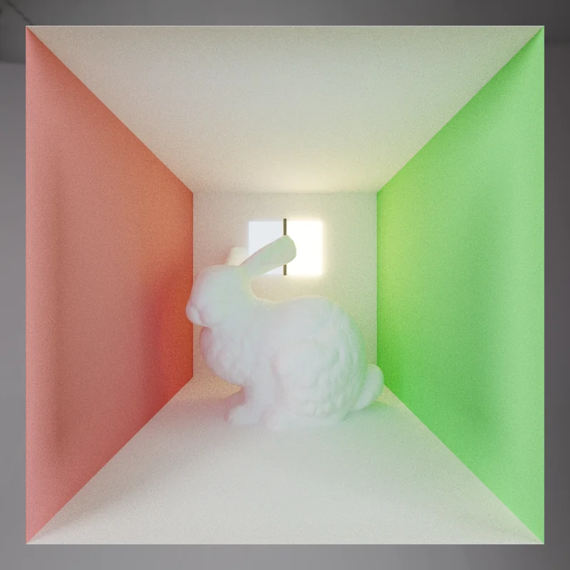
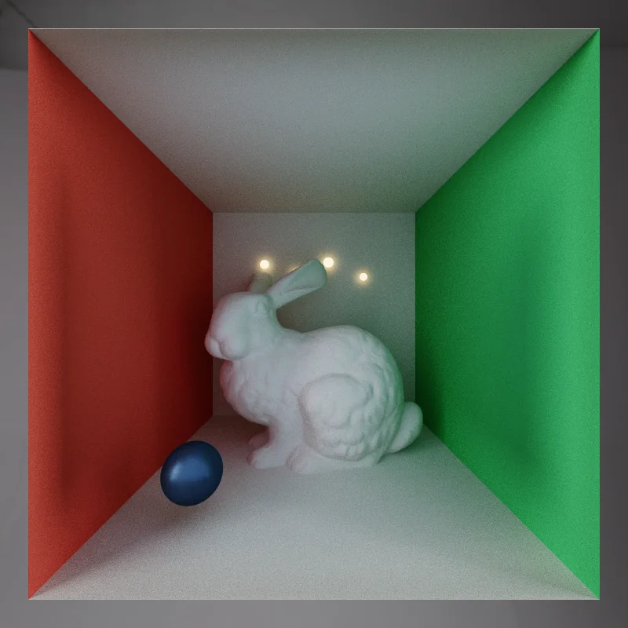
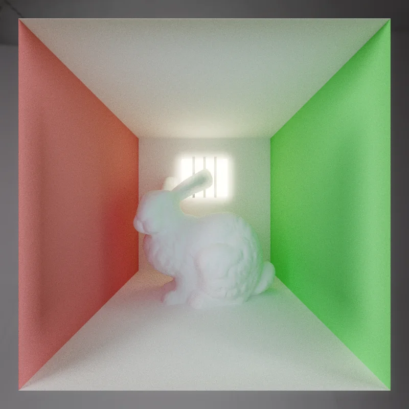
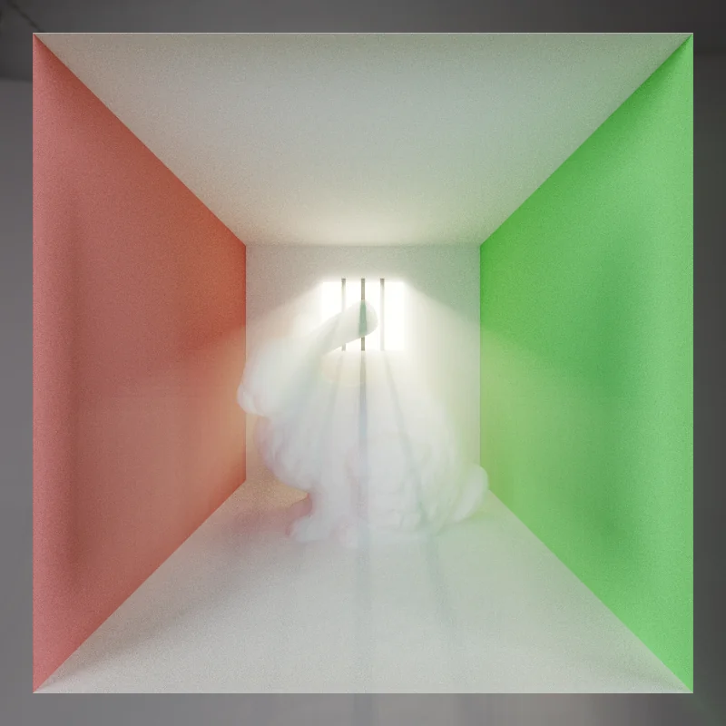

# CUDA Path Tracer

**CUDA · C++ · glTF · BVH · PBR**

A GPU-first renderer for glTF scenes, physically based materials, accelerated ray traversal, cinematic camera effects, and a configurable post-processing stack.

[View the full project page](https://r-murdock.com/cuda-path-tracer)



*Lady Maria of the Astral Clocktower — final scene rendered with the CUDA path tracer.*

## Highlights

- CUDA path tracing with progressive accumulation and an interactive OpenGL preview
- Two-level BVH acceleration for scene objects and mesh triangles
- glTF 2.0 mesh and metallic-roughness material loading
- Diffuse, reflective, refractive, emissive, and textured PBR materials
- Thin-lens depth of field and stochastic antialiasing
- HDR environment maps, ACES tone mapping, bloom, and occlusion-aware god rays
- Stream compaction and Russian Roulette path termination
- Optional bounded participating media and depth-aware fog cards

## Final scene

The portfolio scene combines a million-triangle Lady Maria model with a large Astral Clocktower environment. The renderer handles the complete scene through its glTF pipeline and two-level acceleration structure.

| Clay / PBR disabled | Final PBR render |
| --- | --- |
|  |  |

## Physically based rendering

The material pipeline follows glTF's metallic-roughness workflow. It supports base-color and metallic-roughness textures, normal mapping, emissive response, dielectric transport, reflective surfaces, and HDR environment lighting.

| Imported glTF helmet | Cornell material study |
| --- | --- |
|  |  |

Reflective and refractive BSDFs use ideal reflection/refraction directions with roughness-controlled sampling. Dielectric Fresnel response is approximated with Schlick's equation, including total internal reflection.

## Rendering pipeline

1. **Scene upload** — parse JSON and glTF data, flatten meshes, upload materials and textures, then build acceleration structures.
2. **Ray generation** — create stochastic camera rays with optional thin-lens depth of field.
3. **BVH traversal** — traverse the scene-level BVH and per-mesh triangle BVHs on the GPU.
4. **Shade and compact** — evaluate material response, accumulate terminated paths, and compact surviving rays.
5. **Accumulate and post** — progressively accumulate samples, then apply exposure, bloom, god rays, ACES tone mapping, and gamma correction.

## Acceleration and optimization

### Two-level BVH

The renderer builds a hierarchy over scene instances and a second hierarchy over each mesh's triangles. GPU traversal is iterative and uses a fixed local stack, avoiding recursive device calls.

Benchmarks were recorded on an NVIDIA GeForce RTX 3060 Laptop GPU.

| Scene | Triangles | Without BVH | With BVH | Result |
| --- | ---: | ---: | ---: | ---: |
| Bunny, open scene | 69,451 | 0.4 FPS | 32 FPS | 80× |
| Bunny, closed scene | 69,451 | 1.7 FPS | 97 FPS | 57× |
| Lady Maria, open scene | 1,013,600 | <0.1 FPS | 15 FPS | Interactive |
| Lady Maria, closed scene | 1,013,600 | <0.1 FPS | 37 FPS | Interactive |

### Stream compaction

A scan-and-scatter pipeline removes terminated paths between bounces while preserving their accumulated contribution. The gain depends on how quickly rays leave the scene.

| Scene | Without compaction | With compaction | Change |
| --- | ---: | ---: | ---: |
| Open scene | 13 FPS | 48 FPS | +269% |
| Cornell box | 44 FPS | 52 FPS | +18% |
| Bunny scene | 30 FPS | 32 FPS | +7% |

### Russian Roulette

After a configurable minimum depth, low-throughput paths terminate probabilistically and surviving paths receive energy compensation. In the closed test scene this improved performance from 32 to 37 FPS (+16%) while keeping the estimator unbiased.

### Material sorting experiment

Material sorting was tested as a warp-coherence optimization and deliberately left disabled by default. Its sorting and gather cost exceeded the shading benefit in every measured scene.

| Scene | Without sorting | With sorting | Change |
| --- | ---: | ---: | ---: |
| Cornell box | 44 FPS | 29 FPS | -34% |
| Bunny scene | 43 FPS | 32 FPS | -25% |
| 20+ material scene | 51 FPS | 42 FPS | -18% |

## Camera and post-processing

The same post stack is used by the live CUDA preview and saved output. Settings are read from an optional `PostProcess` block in the scene JSON, so older scenes preserve their original appearance.

### ACES tone mapping

| Linear output | Tone mapped output |
| --- | --- |
|  |  |

### Thin-lens depth of field

| Pinhole camera | Thin-lens camera |
| --- | --- |
|  |  |

### Bloom and god rays

| Bloom | Occlusion-aware god rays |
| --- | --- |
|  |  |

Bloom uses an HDR bright pass, while the god-ray pass supports radial, converging, and directional sampling plus focus, haze, subject-protection, and rim masks. A separate bounded homogeneous volume path is available for physically traced scattering.

## Build and run

Requirements:

- CMake 3.24 or newer
- A C++17 compiler
- NVIDIA CUDA Toolkit and a CUDA-capable GPU
- OpenGL; GLFW and GLEW are included for Windows and discovered from the system on Unix

```bash
cmake -S . -B build
cmake --build build --config Release --parallel
```

Run the generated executable with a scene file:

```bash
cis565_path_tracer scenes/cornell.json
```

The executable is written to `build/bin` for single-config generators or the corresponding configuration directory for multi-config generators.

## Source layout

- `src/pathtrace.cu` — CUDA kernels, traversal, shading, compaction, volumetrics, and GPU post-processing
- `src/postprocess.cpp` — CPU output path for the same HDR post stack
- `src/scene.cpp` — JSON scene parsing and render configuration
- `src/mesh_loader.cpp` — glTF geometry, material, and texture ingestion
- `stream_compaction/` — parallel scan implementation used by the path compaction stage
- `img/portfolio/` — compressed portfolio renders used by this README

Large production scene assets, raw render outputs, build products, and temporary capture files are intentionally excluded from the repository.

## Credits

Developed by [Muqiao Lei](https://github.com/rmurdock41) for University of Pennsylvania CIS 5650: GPU Programming and Architecture.

The project is based on the CIS 5650 CUDA path tracer starter code and uses GLM, GLFW, GLEW, Dear ImGui, nlohmann/json, and tinygltf. Third-party model ownership remains with the respective creators; the repository contains source code and curated render results rather than the large production assets.
