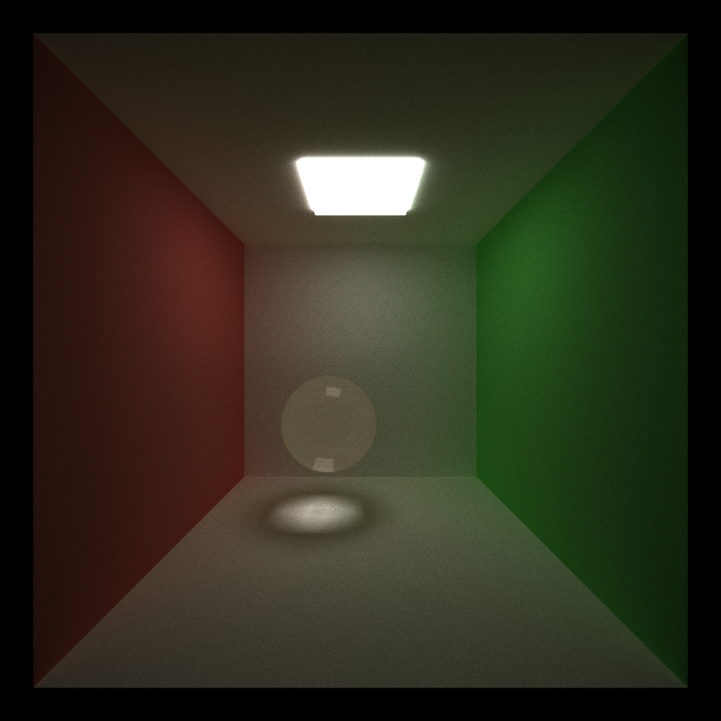

CUDA Path Tracer
================

**University of Pennsylvania, CIS 565: GPU Programming and Architecture, Project 3**

* - Muqiao Lei
    
    [LinkedIn](https://www.linkedin.com/in/muqiao-lei-633304242/) · [GitHub](https://github.com/rmurdock41)
  
  - Tested on: Windows 10, 11th Gen Intel(R) Core(TM) i7-11800H @ 2.30GHz 2.30 GHz, NVIDIA GeForce RTX 3060 Laptop GPU (Personal Computer)

**A CUDA-based path tracer implementing glTF model loading, refractive materials, depth of field, and BVH acceleration. Optimized using Russian Roulette path termination and various GPU performance techniques.**

*[Lady Maria from BLoodborne], 5000 samples, rendered with BVH acceleration*

---

## Visual Features

### Refraction

Implemented **refraction effects** based on Snell's law with Fresnel calculations using Schlick's approximation. Supports transparent materials like glass and water with light bending and internal reflections. Implemented rough refractive surfaces that can simulate effects like frosted glass.

| Clear Glass (IOR 1.5, roughness=0) | Colored Glass | Rough Glass (frosted effect) |
| --- | --- | --- |
|  |  |  |

**Implementation Details:**

Used `glm::refract` to calculate ideal refraction direction and **Schlick's approximation** to compute Fresnel reflection coefficient. The system probabilistically chooses between reflection and refraction based on the Fresnel coefficient, correctly handling total internal reflection cases. 

For **roughness** implementation, the material.roughness parameter controls surface roughness by importance sampling around the ideal reflection or refraction direction. The sampling uses a modified Phong distribution model where higher roughness values produce stronger light scattering, creating realistic frosted effects. 

**Analysis:**

Refractive materials cause light to undergo multiple reflections and refractions inside transparent objects, forming complex light paths. Each refraction event requires computing Fresnel coefficients and probabilistically determining reflection versus refraction. Rough refractive surfaces perturb the ideal refraction direction through importance sampling, producing realistic frosted glass effects. In scenes with multiple refractive objects, rays can bounce multiple times between transparent surfaces - for example, light entering a glass sphere, reflecting internally, refracting out, then entering another nearby glass object.

### Specular Reflection

Implemented perfect specular reflection materials with roughness parameter support, simulating effects from perfect mirrors to rough metallic surfaces.

**Implementation Details:**

Used `glm::reflect` to calculate ideal reflection direction, with material.roughness parameter controlling surface roughness. For perfect mirrors (roughness=0), rays bounce strictly according to the law of reflection. When roughness is greater than 0, importance sampling is performed around the ideal reflection direction using a modified Phong distribution model. Sampling uses a `cosθ^k` distribution where `k = 1/(α²) - 1` and `α = roughness`. Higher roughness values produce larger scattering ranges for reflected rays, with surfaces exhibiting more diffuse characteristics. The system supports material.hasReflective parameter to control reflection strength, enabling partial reflection effects. Material color acts as the Fresnel term for reflection, affecting the color of reflected light.

### Depth of Field

Implemented physically-based thin lens camera model to simulate realistic depth of field effects by sampling on the aperture.

| No DOF                       | with DOF                       |
| ---------------------------- | ------------------------------ |
|  |  |

**Implementation Details:**

Used concentric disk sampling to generate ray origins on the aperture plane, which maps a square to a unit disk, avoiding waste from traditional rejection sampling and providing more uniform distribution. All rays pass through the same point on the focal plane to achieve focus effects. 

The system provides two configurable parameters: apertureRadius controls blur strength, and focalDistance controls focus position. The implementation flow calculates the standard camera ray direction first, then computes the ray's intersection with the focal plane, samples an offset point on the aperture using concentric disk sampling, and finally shoots a ray from the offset point toward the focal plane intersection point.

**Analysis:**

Depth of field only affects the ray generation stage without impacting subsequent intersection testing and shading, resulting in minimal performance overhead. Aperture size has almost no performance impact as computation cost remains constant regardless of aperture size, only the ray origin positions differ. This overhead primarily comes from additional random number generation, focal plane intersection calculation, and ray direction renormalization, all of which are simple arithmetic operations. The performance characteristics of depth of field are independent of scene type (open or closed) because it only modifies ray origins and directions without affecting ray propagation behavior within the scene. 

Data shows that both open and closed scenes experience consistent overhead. This makes depth of field a cost-effective choice for enhancing rendering realism, significantly improving visual quality with negligible impact on frame rate.

### Antialiasing

Implemented stochastic sampled antialiasing by randomly jittering ray positions within each pixel to reduce aliasing artifacts.

**Implementation Details:**

In the `generateRayFromCamera` kernel, each ray receives a random offset within its pixel. Random numbers `jx` and `jy` in the range [0, 1) are generated using `thrust::uniform_real_distribution` and applied to the sub-pixel coordinate calculation. The random number generator is seeded using `makeSeededRandomEngine` based on iteration number and pixel index, ensuring different jitter patterns across iterations. Over multiple iterations, the random jittering samples different positions within each pixel, averaging to produce smooth edges.

**Performance Impact:**

Antialiasing has negligible performance impact (<1%), as it only involves two additional random number generations and simple floating-point operations per ray. These operations occur during the ray generation stage and are insignificant compared to subsequent BVH traversal and shading computations.

---

## glTF Model Loading

Implemented complete glTF 2.0 model loading and rendering using TinyGLTF library, supporting import and rendering of arbitrary triangle meshes.

| Stanford Bunny (69,451 tris) | Lady Maria (1,013,600 tris)   |
| ---------------------------- | ----------------------------- |
|   |  |

**Implementation Details:**

Implemented complete glTF 2.0 file parsing and geometry data extraction pipeline. The system reads mesh data from glTF files, extracts vertex positions and index information, and transforms triangles to world coordinate space. Each loaded mesh constructs an AABB bounding box on the CPU side for subsequent BVH acceleration structure building. Supports model translation, rotation, and scaling transformations, correctly converting model coordinates to scene space through transformation matrices. All triangle data is uniformly stored in GPU memory, with each triangle recording its three vertex positions and material ID. The system manages mesh instances in the scene as MESH-type Geom objects, recording the offset and count of triangles in the global array for subsequent intersection testing.

**Analysis:**

glTF model loading itself has no direct impact on runtime performance as model parsing and data upload are completed during initialization. Runtime performance primarily depends on triangle count and intersection testing efficiency. For models like Stanford Bunny with approximately 70,000 triangles and Lady Maria with over 1 million triangles, BVH acceleration structures have critical performance implications (see BVH section for detailed performance analysis). Triangle data is stored in contiguous arrays on GPU, favoring cache hits and reducing memory access latency. The advantage of glTF format lies in its standardization and widespread support, allowing convenient export from various 3D modeling software and supporting complex scene hierarchies and material definitions.

---

## Performance Optimizations

### Bounding Volume Hierarchy (BVH)

Implemented hierarchical spatial acceleration structure using axis-aligned bounding boxes (AABB), dramatically reducing ray-triangle intersection tests. Uses Surface Area Heuristic (SAH) for CPU-side BVH construction and iterative stack-based traversal on GPU.

| With BVH                           | Without BVH                              |
| ---------------------------------- | ---------------------------------------- |
|  |  |

| *With Tris BVH*                          | Without Tris BVH                            |
| ---------------------------------------- | ------------------------------------------- |
|  |  |

**Implementation Details:**

Constructed BVH tree recursively on CPU using Surface Area Heuristic for optimal split plane selection. During construction, first computes AABB bounding boxes and centroids for all primitives, then selects the axis with maximum centroid distribution as the split axis, using median split strategy to partition primitives into two groups. Leaf nodes contain at most 4 primitives to balance tree depth and leaf complexity. After construction, BVH nodes and primitive indices are uploaded to GPU memory. GPU traversal uses iteration rather than recursion, employing a fixed-size stack (64 levels) to store nodes awaiting visit. For each ray, starting from the root node, performs AABB intersection test first; if intersected, continues traversing child nodes or tests primitives in leaf nodes. System implements two-level BVH structure: scene-level BVH accelerates intersection tests between different objects, mesh-level BVH accelerates triangle intersection tests within individual meshes.

**Performance Analysis:**

| Scene          | Triangle Count | Scene Type | Without BVH | With BVH | Speedup |
| -------------- | -------------- | ---------- | ----------- | -------- | ------- |
| MultiBall      | -              | Open       | 40 fps      | 55 fps   | 38%     |
| MultiBall      | -              | Closed     | 10 fps      | 19 fps   | 90%     |
| Cube           | 12             | Open       | 60 fps      | 60 fps   | -       |
| Cube           | 12             | Closed     | 44 fps      | 44 fps   | -       |
| Stanford Bunny | 69,451         | Open       | 0.4 fps     | 32 fps   | 80x     |
| Stanford Bunny | 69,451         | Closed     | 1.7 fps     | 97 fps   | 57x     |
| Lady Maria     | 1,013,600      | Open       | <0.1 fps    | 15 fps   | -       |
| Lady Maria     | 1,013,600      | Closed     | <0.1 fps    | 37 fps   | -       |

**BVH Statistics:**

| Scene          | Triangle Count | Mesh BVH Nodes | Scene BVH Nodes |
| -------------- | -------------- | -------------- | --------------- |
| Multiball      | -              | -              | 43              |
| Stanford Bunny | 69,451         | 40,597         | 3               |
| Lady Maria     | 1,013,600      | 524,287        | 3               |

*Note: Mesh BVH nodes accelerate triangle intersection tests within individual models, Scene BVH nodes accelerate intersection tests between different objects in the scene*

**Analysis:**

BVH acceleration structure reduces linear search complexity from O(n) to O(log n) through spatial hierarchy partitioning. For simple models like the cube with only 12 triangles, BVH traversal overhead may exceed saved intersection testing time, resulting in negligible acceleration. However, when triangle count increases to tens of thousands, BVH advantages become significantly apparent. 

For Stanford Bunny with 70,000 triangles, BVH reduces average triangles tested per ray from 69,451 to tens, achieving several to tenfold performance improvement. For Lady Maria with 1 million triangles, rendering without BVH is nearly impossible (<1 fps), while BVH provides tens to hundreds of times speedup, enabling real-time rendering. 

Comparing open and closed scenes shows that BVH acceleration effectiveness is largely independent of scene type, as BVH primarily optimizes the intersection testing stage rather than ray bouncing behavior. Closed scenes have lower baseline FPS due to more ray bounces, but BVH speedup ratios remain similar across both scene types. Two-level BVH structure enables efficient handling of scenes with multiple complex models: scene-level BVH quickly locates potentially intersected objects, mesh-level BVH rapidly finds intersected triangles within objects. Iterative traversal on GPU avoids recursion overhead and stack overflow issues, with fixed 64-level stack satisfying most scene requirements. AABB intersection testing uses slab method, computationally simple and efficient, suitable for GPU's SIMD architecture.

### Russian Roulette Path Termination

Probabilistically terminates paths based on their energy contribution, reducing computation while maintaining unbiased results.

| RR minDepth=1                                          | RR minDepth=3                                          | No RR                                                         |
| ------------------------------------------------------ | ------------------------------------------------------ | ------------------------------------------------------------- |
|  |  |  |

**Implementation Details:**

Implemented probability-based termination strategy using path throughput. The system provides a configurable minimum bounce depth (minDepth) parameter, preventing path termination before reaching this depth to ensure basic lighting effects. Starting from minDepth, survival probability is calculated based on path energy contribution, computed as the maximum component of the path color and clamped between 0.05 and 0.99 to avoid premature or ineffective termination. For each ray, a random number is compared with survival probability; if the random number exceeds survival probability, the path is terminated, otherwise the path color is divided by survival probability for energy compensation to maintain unbiasedness. This strategy allows high-contribution paths to continue tracing while low-contribution paths terminate early, saving computational resources.

**Performance Analysis:**

**Open Scene :**

| Configuration   | FPS    | vs No RR |
| --------------- | ------ | -------- |
| No RR           | 92 fps | -        |
| RR (minDepth=1) | 92 fps | +XX%     |
| RR (minDepth=3) | 91 fps | +XX%     |

**Closed Scene :**

| Configuration   | FPS    | vs No RR |
| --------------- | ------ | -------- |
| No RR           | 32 fps | -        |
| RR (minDepth=1) | 37 fps | +XX%     |
| RR (minDepth=3) | 36 fps | +XX%     |

**Analysis:** 

Russian Roulette shows scene-dependent performance characteristics. In open scenes, the optimization provides negligible benefit (0% to -1%), while in closed scenes it achieves meaningful improvements (+13-16%). Open scenes show minimal or slightly negative impact from Russian Roulette. With a baseline of 92 fps, rays already escape scene boundaries quickly, naturally terminating within a few bounces. The overhead of Russian Roulette calculations (survival probability computation, random number generation, energy compensation) outweighs any computational savings from early termination. Most rays that would be terminated by RR have already exited the scene through natural means. Closed scenes demonstrate clear benefits from Russian Roulette, with 13-16% performance improvement. Rays remain trapped within the enclosed environment and continue bouncing until reaching maximum depth or absorption. Russian Roulette provides an additional termination mechanism based on energy contribution, allowing low-contribution paths to exit early rather than consuming resources for negligible visual impact. The minDepth=1 configuration achieves slightly higher gains (+16%) by allowing earlier termination, while minDepth=3 (+13%) ensures more complete light transport at the cost of marginally lower performance. The performance difference between minDepth=1 and minDepth=3 is minimal in both scene types (1-3% variation), indicating that the first few bounces contribute significantly to the final image and are rarely terminated even with aggressive RR settings. Visual quality remains indistinguishable across all configurations at 5000 samples, validating Russian Roulette's unbiased nature through energy compensation. 

**Conclusion:**

 Russian Roulette is most effective in closed scenes where rays have long path lengths. For open scenes with naturally short paths, the optimization overhead may exceed benefits. The technique maintains image quality through proper energy compensation while providing meaningful performance gains in appropriate scenarios.

### Material Sorting

Implemented ray sorting by material type before shading to group rays interacting with the same material in contiguous memory, improving GPU warp coherence and reducing thread divergence.

**Implementation Details:**

The material sorting system uses a three-stage pipeline for each bounce. First, each ray is assigned a material key based on its intersection, with missed rays assigned `INT_MAX` to sort them to the end of the array. Then `thrust::stable_sort_by_key` sorts material keys while maintaining ray indices. Finally, `thrust::gather` reorders both `PathSegment` and `ShadeableIntersection` arrays according to the sorted indices. The system supports runtime toggling via `SetMaterialSortEnabled()`.

**Performance Analysis:**

| Scene Type           | Material Count                  | Without Sorting | With Sorting | Performance Change |
| -------------------- | ------------------------------- | --------------- | ------------ | ------------------ |
| Cornell Box (Closed) | 3 (diffuse, specular, emissive) | 44 fps          | 29 fps       | -34%               |
| Cornell Box + Bunny  | 3 (diffuse, bunny, emissive)    | 43 fps          | 32 fps       | -25%               |
| Simple Open Scene    | 20+ materials                   | 51 fps          | 42 fps       | -18%               |

**Analysis:**

Material sorting performs as a negative optimization across all test scenes, with performance degradation ranging from 18% to 34%. Even in the complex open scene with over 20 material types, sorting still causes an 18% performance loss.

The Cornell Box closed scene shows the largest performance degradation (-34%). With only 3 material types, material distribution is already relatively concentrated, resulting in low baseline warp divergence. The overhead from sorting operations each bounce (`buildMaterialKeys`, `thrust::stable_sort_by_key`, two `thrust::gather` calls) exceeds any benefits from reduced divergence. The higher baseline framerate (44 fps) means shorter frame time, making sorting's fixed overhead represent a larger fraction of total time.

The Bunny scene shows 25% performance degradation. With the same 3 material types, but 69,451 triangles causing BVH traversal to dominate execution time, material shading represents only a small fraction of total time. Even complete elimination of material shading divergence has limited impact on overall performance. Sorting overhead cannot be offset by shading optimizations.

The simple open scene contains 20+ different materials (multiple refractive types, specular variations, roughness changes), theoretically the most favorable case for material sorting. However, it still shows 18% performance degradation. Despite high material diversity, the O(n log n) complexity and global memory access overhead of sorting still exceed the benefits from reduced warp divergence. This scene has the highest baseline framerate (51 fps), indicating lighter computational burden, making sorting overhead's relative impact more apparent.

**Conclusion:**

Material sorting is a negative optimization across all test scenes. Even with over 20 material types, sorting overhead exceeds its benefits. This indicates that in the current implementation, the fixed cost of sorting operations (memory access, sorting algorithm itself) is too high to be offset by warp coherence improvements. This optimization is disabled by default across all scenes.

### Stream Compaction

Implemented work-efficient stream compaction using the scan-based algorithm from Project 2 to remove terminated paths and improve GPU utilization.

**Implementation Details:**

Stream compaction uses a three-kernel pipeline to remove dead rays. `kernFlagAlive` marks each path as alive (1) or terminated (0) based on `remainingBounces > 0`, with terminated paths having their colors set to zero. `scanDevice` performs a parallel prefix sum on the flag array to compute output indices for alive rays, using the work-efficient scan implementation from Project 2. `kernScatterPaths` scatters alive rays to the computed indices, compacting them into contiguous memory. Both `PathSegment` and `ShadeableIntersection` arrays are compacted to maintain correspondence. Before compaction, the `accumulateTerminated` kernel atomically adds terminated ray colors to the output image, ensuring no light contributions are lost.

**Performance Analysis:**

| Scene Type           | Without Compaction | With Compaction | Speedup |
| -------------------- | ------------------ | --------------- | ------- |
| Cornell Box (Closed) | 44 fps             | 52 fps          | +18%    |
| Cornell Box + Bunny  | 30 fps             | 32 fps          | +7%     |
| Simple Open Scene    | 13 fps             | 48 fps          | +269%   |

**Analysis:**

Stream compaction's performance improvement varies significantly across scenes, ranging from 7% to 269%, reflecting fundamental differences in scene geometry and ray termination patterns.

The simple open scene shows the largest performance improvement (+269%). This scene contains nested refractive spheres and multiple material types but no enclosing walls, causing many rays to escape scene boundaries after early bounces. Without compaction, terminated rays still occupy GPU resources executing useless kernel calls. Compaction begins reducing ray count from early bounces, significantly decreasing computation in subsequent bounces. The low baseline framerate (13 fps) indicates severe computational waste without compaction.

The Cornell Box closed scene achieves moderate improvement (+18%). In the enclosed environment, rays remain trapped and can only terminate by reaching maximum depth, hitting light sources, or through Russian Roulette. Rays terminate gradually over multiple bounces, with compaction benefits accumulating in later bounces. The higher baseline framerate (44 fps) indicates the scene itself has lighter computational burden, limiting compaction's absolute gains.

The Bunny scene shows minimal improvement (+7%). The Stanford Bunny contains 69,451 triangles, with BVH traversal and triangle intersection tests dominating execution time. While stream compaction reduces ray count, each remaining ray still requires expensive BVH traversal. Compaction primarily optimizes material shading and memory access, which represent a smaller fraction of total execution time. The lower baseline framerate (30 fps) reflects that geometric complexity, not ray management, is the primary bottleneck.

**Conclusion:**

Stream compaction provides positive gains across all test scenes but is highly dependent on scene characteristics. Open scenes achieve extreme benefits from rapid ray escape, closed simple scenes gain steady improvements, and geometrically complex scenes show limited gains due to other bottlenecks. This optimization is enabled by default across all scenes.

#### Ray Survival Analysis

To evaluate stream compaction's effectiveness, we measured the number of active rays after each bounce in a single iteration.

| Bounce | Open Scene Active Rays | Open Scene % Alive | Closed Scene Active Rays | Closed Scene % Alive |
| ------ | ---------------------- | ------------------ | ------------------------ | -------------------- |
| 1      | 344,766                | 53.9%              | 522,846                  | 81.7%                |
| 2      | 163,001                | 25.5%              | 363,060                  | 56.7%                |
| 3      | 94,276                 | 14.7%              | 285,269                  | 44.6%                |
| 4      | 52,515                 | 8.2%               | 232,608                  | 36.3%                |
| 5      | 23,149                 | 3.6%               | 190,829                  | 29.8%                |
| 6      | 11,514                 | 1.8%               | 156,449                  | 24.4%                |
| 7      | 6,577                  | 1.0%               | 129,115                  | 20.2%                |
| 8      | 0                      | 0.0%               | 0                        | 0.0%                 |

**Analysis:**

In open scenes, rays rapidly escape scene boundaries. Nearly half of all rays terminate after the first bounce, with over 90% eliminated by bounce 4. Stream compaction dramatically reduces the number of rays processed in subsequent kernels from early bounces onward.

In closed scenes, rays remain trapped within the enclosure and continue bouncing. Over 80% of rays remain active after the first bounce, with one-third still alive at bounce 4. Rays repeatedly interact with surfaces in the confined space, causing stream compaction benefits to accumulate gradually.

This difference in ray termination patterns directly explains the performance data. Open scenes achieve massive acceleration (+269%) through aggressive early compaction, while closed scenes gain moderate improvement (+18%) due to slower ray termination.

Stream compaction eliminates a critical GPU inefficiency: terminated rays still occupy memory and trigger kernel execution. At bounce 4 in the open scene, processing 640,000 rays when only 8% are actually active represents massive computational waste. Stream compaction removes these dead rays, focusing GPU resources on meaningful computation.

---

## Third-Party Code and Assets

This project uses the following third-party libraries and assets:

### Libraries

- **[TinyGLTF](https://github.com/syoyo/tinygltf)** - glTF 2.0 model loading library for parsing and loading glTF mesh files

- **[GLM](https://github.com/g-truc/glm)** - OpenGL Mathematics library for vector and matrix operations

### 3D Models

- **[Bloodborne - Lady Maria of the Astral Clocktower](https://sketchfab.com/3d-models/bloodborne-lady-maria-of-the-astral-clocktower-ad406857d8c64115aba721ee98b666bb)** by [Redeemer](https://sketchfab.com/redeemer_3d) - Used for high-polygon mesh rendering demonstration and BVH performance testing

- **[Stanford Bunny](http://graphics.stanford.edu/data/3Dscanrep/)** - Stanford Computer Graphics Laboratory, used for BVH performance testing

### Base Code

This project builds upon the CIS 565 CUDA Path Tracer base code provided by the University of Pennsylvania, including OpenGL/CUDA interop framework, scene loading infrastructure, and basic ray-triangle intersection functions.

All other implementations (BVH construction, material shading, Russian Roulette, stream compaction, etc.) are original work completed for this project.

---

## CMakeLists.txt Modifications

The CMakeLists.txt was modified to support glTF model loading and enable stream compaction functionality. Key changes include: added `find_package(CUDAToolkit REQUIRED)` to explicitly locate the CUDA toolkit; created a `tinygltf_impl` static library for glTF parsing; uncommented `add_subdirectory(stream_compaction)` to enable Project 2's stream compaction implementation; added `mesh_loader.h` and `mesh_loader.cpp` files to the executable; included the TinyGLTF directory in the main program's include paths; linked both `stream_compaction` and `tinygltf_impl` libraries; and added CUDA include directories for Windows platforms to ensure header file accessibility. These modifications enable the project to load and render complex mesh models in glTF format while utilizing efficient stream compaction optimization.
